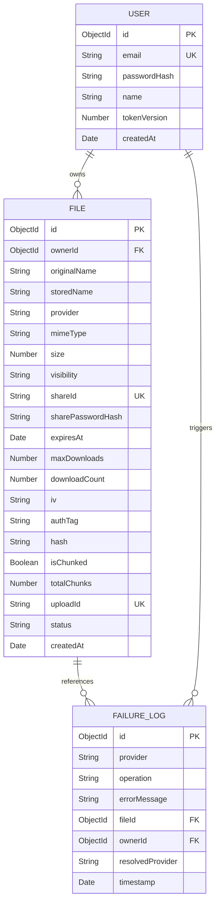

# NimbusFS

Distributed multi-cloud file storage backend with automatic failover, server-side encryption, and access-controlled link sharing.

---

## What is NimbusFS?

NimbusFS is a multi-cloud file storage manager designed to address the risks of single-provider dependency (e.g., service outages, latency spikes, or credential expiration) and the security vulnerabilities of storing plaintext assets on third-party cloud infrastructure.

By decoupling the storage interface from specific cloud providers, NimbusFS implements an abstraction layer that handles transparent, server-side symmetric encryption (`aes-256-gcm`) and dynamic health checks. It manages cascading failovers across multiple storage services, falling back to background message queues when providers are unreachable.

---

## Key Features & Implementation Status

| Feature | Description | Status |
| :--- | :--- | :--- |
| **Multi-Cloud Storage Abstraction** | Unified interface for file operations across Cloudinary, Supabase, and local disk. | **IMPLEMENTED** |
| **Server-Side Encryption** | Automatic encryption of all file buffers using AES-256-GCM prior to cloud upload. | **IMPLEMENTED** |
| **User-Scoped Deduplication** | SHA-256 content hashing to identify duplicate files and optimize storage consumption. | **IMPLEMENTED** |
| **Access-Controlled Sharing** | Expiry limits, download limits, and password protection (`bcrypt`) on public share links. | **IMPLEMENTED** |
| **Failover Storage Engine** | Pre-upload health checks and inline fallbacks when the primary provider goes down. | **IMPLEMENTED** |
| **Background Upload Worker** | BullMQ and Redis job queuing for asynchronous retries of failed uploads. | **IMPLEMENTED** |
| **Active Token Invalidation** | Version-based JWT invalidation on user logout. | **IMPLEMENTED** |
| **Chunked File Uploads** | Multi-part upload initialization, chunk storage, and reassembly. | **PARTIALLY IMPLEMENTED** (Integration Bug Present) |
| **Self-Service Password Reset** | Forgotten password reset request and email generation. | **PRESENT BUT UNUSED** (UI exists, backend route absent) |
| **Automated Test Suite** | In-code unit/integration tests running via `npm test`. | **NOT FOUND** (Audit log exists, but test scripts/code are absent) |

---

## System Architecture

NimbusFS utilizes a client-server architecture backed by a document database, in-memory caching, and asynchronous workers.

```text
               +----------------------------------------+
               |          React / Vite Client           |
               +----------------------------------------+
                                    |
                                    | HTTPS / JWT
                                    v
               +----------------------------------------+
               |        Express.js API Gateway          |
               +----------------------------------------+
                 /                  |                 \
  Zod Validation/    Mongoose Models|                  \ BullMQ Jobs
               v                    v                   v
        +------------+        +------------+      +------------+
        | Middleware |        |  MongoDB   |      | Redis Cache|
        +------------+        +------------+      +------------+
                                    |                   |
                                    |                   v
                                    |             +------------+
                                    |             | Bull Worker|
                                    |             +------------+
                                    |                   |
                                    +---------+---------+
                                              |
                                              v
                              +-------------------------------+
                              |    Storage Abstraction Layer  |
                              +-------------------------------+
                               /              |              \
                              v               v               v
                      +--------------+ +--------------+ +------------+
                      | Cloudinary   | | Supabase S3  | | Local Disk |
                      |  (Primary)   | | (Secondary)  | | (Fallback) |
                      +--------------+ +--------------+ +------------+
```

### Module Descriptions
- **Frontend Client**: Built with React (Vite) and Tailwind CSS. Implements session management via React Context, a drag-and-drop file interface, and dashboard dashboards for system admins to monitor storage health.
- **API Gateway (Express)**: Manages authentication, endpoint routing, Zod validation pipelines, and Helmet-secured CORS configurations.
- **Storage Abstraction Layer**: Exposes a unified `StorageProvider` interface. Encrypts plaintext payloads, performs pre-upload health checks, and routes files to healthy providers.
- **Job Engine (BullMQ + Redis)**: Coordinates background retries. When all online cloud providers fail during an upload, the server saves the metadata to MongoDB, base64-encodes the encrypted payload, and passes it to Redis to be handled asynchronously.

---

## Core Data Flows

### 1. File Upload & Encryption Flow
```text
Client            Express API         Deduplication Check      AES-256-GCM           Storage Manager
  |                    |                       |                    |                       |
  |--- POST /upload -->|                       |                    |                       |
  |                    |--- Sniff MIME & Hash -|                    |                       |
  |                    |                       |                    |                       |
  |                    |<-- Duplicate Found ---|                    |                       |
  |                    |    (Return 200 OK)    |                    |                       |
  |                    |                                            |                       |
  |                    |------------------- Encrypt Buffer -------->|                       |
  |                    |                                            |<-- Return IV/Tag -----|
  |                    |                                                                    |
  |                    |-------------------------------- Upload (Encrypted Buffer) -------->|
  |                    |                                                                    |-- Try Cloudinary
  |                    |                                                                    |-- Fallback Supabase
  |                    |                                                                    |-- Queue BullMQ
```

### 2. Secure File Download & Decryption Flow
1. Client requests `GET /api/files/:id/download` (or `GET /api/share/:shareId`).
2. Server queries MongoDB for the file metadata.
3. Access authorization checks are performed (validating ownership, expiration, downloads, and link password).
4. If allowed, server streams the encrypted binary payload from the mapped provider.
5. Server buffers the chunks and decrypts them using the file's saved `iv` and `authTag`.
6. Server sets content headers (`Content-Disposition`) and streams the plaintext binary back to the client.

---

## Storage & Fallover Strategy

NimbusFS isolates cloud provider logic behind a `StorageProvider` base class. Providers are registered in a priority-ordered sequence:
1. **Cloudinary** (Primary Cloud Storage)
2. **Supabase Storage** (Secondary Cloud Storage)
3. **Local Disk** (Last-resort disk-based storage inside the `/uploads` directory)

### Pre-Upload Health check & Failover Loop
Prior to committing a write, [storageManager.js](file:///c:/Users/ramit/Resume_projects/NimbusFS/src/storage/storageManager.js) initiates a ping sequence:
- If a provider's health check fails or the upload raises an exception, the manager logs the exception to MongoDB ([FailureLog.js](file:///c:/Users/ramit/Resume_projects/NimbusFS/src/storage/FailureLog.js)) and drops down to the next provider.
- If all cloud options fail, the encrypted buffer is base64-encoded and queued in BullMQ. A background worker retries the upload periodically, updating the file's provider metadata once successful.

---

## Authentication & Security

- **JSON Web Tokens (JWT)**: Features a dual-token design. Access tokens have a 15-minute lifetime, while HTTP-Only, Secure, SameSite-Strict cookies store a 7-day refresh token.
- **Active Invalidation**: Stores a `tokenVersion` counter on the [User](file:///c:/Users/ramit/Resume_projects/NimbusFS/src/auth/User.js) schema. Logging out increments this counter, rendering all active tokens invalid immediately.
- **Data Confidentiality**: File buffers are encrypted locally using AES-256-GCM. Cloud providers only receive high-entropy binary blobs. Symmetric keys are kept in server environment files.
- **File Sniffing Protection**: Integrates the `file-type` magic number sniffer on the server to prevent malicious file extension spoofing (e.g., executing a hidden `.exe` uploaded as a `.txt` file).
- **Access Limits**: The [fileAccess.js](file:///c:/Users/ramit/Resume_projects/NimbusFS/src/utils/fileAccess.js) helper verifies bcrypt-hashed link passwords, expiration limits, and maximum download caps.

---

## Database Design

NimbusFS uses three Mongoose-mapped collections in MongoDB:



### Critical Indexes
- `{ shareId: 1 }` (Sparse): For efficient public share link lookups.
- `{ uploadId: 1 }` (Sparse): Speeds up tracking of multi-part chunked upload sessions.
- `{ hash: 1, ownerId: 1 }` (Compound): Allows rapid, user-scoped content checks for deduplication.

---

## API Routes Overview

| Method | Endpoint | Description | Auth Required |
| :--- | :--- | :--- | :---: |
| **POST** | `/api/auth/register` | Create a new user profile | No |
| **POST** | `/api/auth/login` | Login user, return JWT and refresh cookie | No |
| **POST** | `/api/auth/refresh` | Issue new access token via refresh token | No |
| **POST** | `/api/auth/logout` | Clear refresh token and increment `tokenVersion` | No |
| **GET** | `/api/auth/profile` | Retrieve authenticated user profile | **Yes** |
| **POST** | `/api/files/upload` | Upload and encrypt a single file | **Yes** |
| **POST** | `/api/files/upload/init` | Initialize chunked upload session | **Yes** |
| **POST** | `/api/files/upload/chunk` | Upload individual file chunk | **Yes** |
| **POST** | `/api/files/upload/complete` | Reassemble, encrypt, and commit chunked file | **Yes** |
| **GET** | `/api/files/:id/download` | Decrypt and stream file to owner | **Yes** |
| **GET** | `/api/files` | Get user's uploaded files (paginated) | **Yes** |
| **DELETE**| `/api/files/:id` | Delete file from db and active provider | **Yes** |
| **POST** | `/api/files/:id/share` | Generate public access credentials for a file | **Yes** |
| **POST** | `/api/files/:id/revoke-share`| Revert file visibility to private | **Yes** |
| **GET** | `/api/share/:shareId` | Download shared file (processes password/expiry) | No |
| **GET** | `/api/health/storage` | Check health and latency of all storage providers | **Yes** |
| **GET** | `/api/admin/failures` | Retrieve history of system failures (paginated) | **Yes** |
| **POST** | `/api/admin/cleanup-chunks` | Clean up expired memory chunks and upload documents | **Yes** |

---

## Project Structure

```text
NimbusFS/
├── client/                     # Frontend Workspace (Vite + React)
│   ├── src/
│   │   ├── api/                # Custom API client handler
│   │   ├── components/
│   │   │   ├── files/          # Upload and Share modal overlays
│   │   │   ├── layout/         # App navbar/sidebar shell
│   │   │   └── ui/             # Reusable cards, buttons, inputs
│   │   ├── context/            # Toast and Auth global states
│   │   └── pages/              # Page components (Dashboard, Shared, Admin, etc.)
├── src/                        # Backend Application Workspace (Node/Express)
│   ├── auth/                   # Users schema, controller, and routes
│   ├── config/                 # Env loading and strict key validation
│   ├── controllers/            # Controller layers (Files, Shares, Admin)
│   ├── jobs/                   # Redis connection, BullMQ queue, and workers
│   ├── middleware/             # Rate limiters, JWT checking, and Zod validator
│   ├── providers/              # Multi-cloud storage API clients
│   ├── routes/                 # Routing endpoints
│   ├── storage/                # StorageManager facade and FailureLog schema
│   ├── utils/                  # Encryptor, Hash generator, and Retry helpers
│   └── server.js               # Main server entrypoint
├── eslint.config.js            # Linter rules configuration
├── package.json                # Dependencies and dev start scripts
└── README.md                   # Project documentation
```

---

## Setup & Local Development

### Prerequisites
- Node.js (v18+)
- MongoDB running locally or via MongoDB Atlas
- Redis instance (required for BullMQ upload worker)

### Environment Setup
Create a `.env` file in the backend root based on `.env.example`:

```ini
PORT=5000
MONGO_URI=mongodb://localhost:27017/nimbusfs
ALLOWED_ORIGIN=http://localhost:5173
JWT_SECRET=your_jwt_access_secret_key
REFRESH_TOKEN_SECRET=your_jwt_refresh_secret_key
MAX_FILE_SIZE_MB=10

# Cloudinary Setup
CLOUDINARY_CLOUD_NAME=your_cloud_name
CLOUDINARY_API_KEY=your_api_key
CLOUDINARY_API_SECRET=your_api_secret

# Supabase Setup
SUPABASE_URL=your_supabase_project_url
SUPABASE_SERVICE_ROLE_KEY=your_supabase_service_role_key
SUPABASE_BUCKET=nimbusfs-files

# Redis Connection (BullMQ)
REDIS_URL=redis://127.0.0.1:6379

# AES-256-GCM Symmetric Key (Must be exactly 64 hex characters)
ENCRYPTION_KEY=0123456789abcdef0123456789abcdef0123456789abcdef0123456789abcdef
```

### Installation
1. Install backend dependencies and run the server:
   ```bash
   npm install
   npm run dev
   ```
2. Install frontend dependencies and run the client:
   ```bash
   cd client
   npm install
   npm run dev
   ```

---

## Testing & Verification

While there is no automated test framework configured in `package.json` for manual execution, a verification run is documented in [audit_results.json](file:///c:/Users/ramit/Resume_projects/NimbusFS/audit_results.json). This audit evaluates security configurations, failover routing, rate limiting, and permission rules.

You can verify the API contract manually using postman/curl queries based on the paths in [routes](file:///c:/Users/ramit/Resume_projects/NimbusFS/src/routes).

---

## Current Limitations & Known Issues

1. **Broken Chunked Uploads (Zod Schema Mismatch)**:
   The client-side uploader sends the key `totalSize` when initializing chunked uploads, while the Zod schema in [validate.js](file:///c:/Users/ramit/Resume_projects/NimbusFS/src/middleware/validate.js#L72) enforces the key `size`. This causes all chunked uploads to fail validation with an HTTP `400` error code.
2. **Stateful Chunks**:
   Chunks are stored in-memory in a JavaScript `Map` on the server instance. Scaling the backend horizontally behind a standard load balancer without sticky sessions will result in fragmented uploads.
3. **No Database Transaction Safeguards**:
   If a file upload succeeds on a cloud provider but the server crashes before saving the metadata to MongoDB, the cloud asset becomes orphaned. There is no cleanup process or database transaction to rollback orphaned uploads.

---

## AI-Assisted Development

This repository contains reusable agent instructions and custom system instructions under the `.agents`, `.claude`, `.kilocode`, and `.zencoder` directories. These directories are used to guide AI development agents when modifying the codebase, maintaining styling consistencies, and running validation audits. They are not part of the runtime application code.

---

## License
This project is licensed under the **ISC License** (refer to `package.json`).
